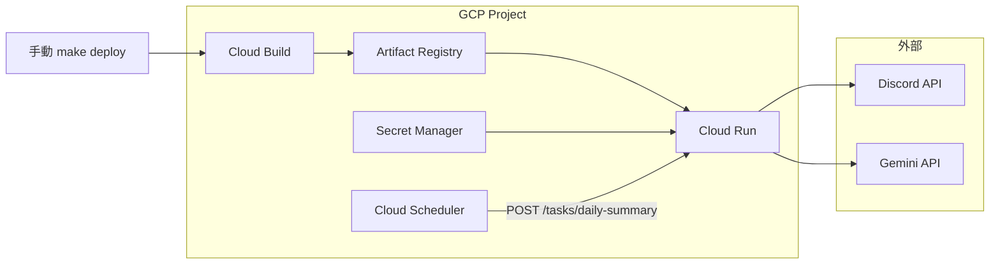

# Yukan

Yukan は Discord サーバー内の過去 24 時間分のメッセージを収集し、Gemini API を使って夕刊ダイジェストを生成・投稿する自動化ボットです。  
Cloud Scheduler などから `/tasks/daily-summary` を定期実行するだけで、決まったチャンネルにハイライトを届けられます。

## アーキテクチャ概要
```
Cloud Scheduler/Tasks ──► HTTP /tasks/daily-summary
                               │
                               ▼
                  summary.Service
                    ├─ collector (Discord API)
                    ├─ prompt builder
                    ├─ Gemini client
                    └─ presenter (embeds, fallback)
                               │
                               ├─ notifier (Discord log)
                               └─ Discord投稿
```

## セットアップ
1. [mise](https://mise.jdx.dev/) を用意し、`mise install` で Go と aqua を、`aqua i` で開発用 CLI ツールをインストールします。
2. Discord Bot Token・Gemini API Key を取得し、Secret Manager などに保存します。
3. 環境変数を設定してローカルで起動します(`.env` ファイルの自動読み込みは無いため、`export` するか direnv などを利用してください):
   ```bash
   export DISCORD_BOT_TOKEN=xxxx
   export GEMINI_API_KEY=yyyy
   make run
   ```
4. Bot を動かしたまま `curl -X POST http://localhost:8080/tasks/daily-summary?target=dev` を実行すると dev チャンネル向け夕刊を投稿します。

## 主要環境変数
| 変数 | 必須 | 説明 |
| --- | --- | --- |
| `DISCORD_BOT_TOKEN` | ✅ | Discord Bot のトークン |
| `GEMINI_API_KEY` | ✅ | Gemini API キー |
| `GEMINI_MODEL` |  | 使用するモデル (例: `gemini-2.5-flash`) |
| `PORT` |  | HTTP サーバーの待ち受けポート (既定: `8080`) |
| `YUKAN_LOG_CHANNEL_ID` |  | ログ通知先 Discord チャンネル ID |
| `YUKAN_DEFAULT_TARGET` |  | `/tasks/daily-summary` 未指定時に使うターゲット名 (既定: `prod`) |
| `YUKAN_SUMMARY_TARGETS` | ✅ | `{"prod":{"guild_id":"...","channel_id":"..."},"dev":{...}}` の JSON (本番値は `infra/` の Terraform が注入) |
| `YUKAN_SUMMARY_LOOKBACK_HOURS` |  | メッセージ収集のルックバック時間 (既定 24) |
| `YUKAN_SUMMARY_FETCH_LIMIT` |  | チャンネルごとのページングサイズ (既定 100) |
| `YUKAN_SUMMARY_MESSAGE_BUDGET` |  | 見出しメッセージ最大文字数 (既定 1800) |
| `YUKAN_SUMMARY_MAX_HIGHLIGHTS` |  | Gemini に要求する最大ハイライト数 (既定 3) |
| `YUKAN_SUMMARY_MAX_ATTEMPTS` |  | Gemini 呼び出しリトライ回数 (既定 5) |
| `YUKAN_SUMMARY_MAX_CONCURRENCY` |  | チャンネル収集の並列数 |
| `YUKAN_FORCE_EMPTY_HIGHLIGHTS` |  | テスト・デバッグ用: `true` で Gemini を呼ばず空ハイライトを返す |

## デプロイ
デプロイは GitHub Actions で行います。手元からの `make deploy` は廃止しました。

1. main にマージすると `deploy` ワークフローが SHA タグ付きイメージをビルドし **staging** (`discord-yukan-stg`) に自動デプロイ
2. staging を検証したら、Actions の `promote` ワークフローを手動実行して同じイメージを **prod** (`discord-yukan`) に昇格

インフラ (Cloud Run / Scheduler / IAM / Secret Manager) は `infra/` の Terraform + tfaction で管理しています。詳細は [infra/README.md](infra/README.md) を参照。

## フロー図

